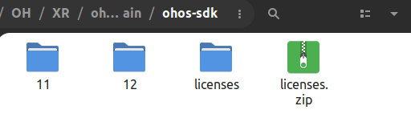

# OH Project (ArkTS) Commands on Linux

## Background

For some unfortunate reasons, HUAWEI's official support for DevEco Studio is limited to Windows and MacOS, making it difficult to compile and upload an ArkTS project on Linux.

So this project plans to solve this problem, from **source code compilation, image burning (rk3568) to ArkTS project uploading** to Linux platform, in order to improve the convenience of development.

## How to use

### Pre-requisites

1. Unzip the project clone / download and add the project root directory to the `$PATH` environment variable (`.bashrc/.zshrc` is recommended). 2;
2. Prepare Java (1.8+) and Python3 (3.6+), and make sure you can call `java` and `python3` from the command line;

### Managing an ArkTS project

1. Prepare the OpenHarmony SDK;
2. Set the environment variable `OHOS_SDK` (it is recommended to write `.bashrc/.zshrc`) to the root directory of your OpenHarmony SDK. Note that it needs to contain the API version number, e.g. `[...]/11`;
3. Call the script in the root directory of an **<u>OH ArkTS project</u>**! For example, `oh-sync-project`. 4;
4. For a new ArkTS project, execute `oh-sync-project` once;

> The commands are as follows:
>
> - `oh-sync-project`: synchronize the current ArkTS project;
> - `oh-sign-hap`: sign the hap package for the current ArkTS project;
> - `oh-build-hap`: build only ArkTS projects as hap packages;
> - `oh-install-hap`: install only the output hap packages of the ArkTS project to the development board;
> - `oh-build-and-run`: build hap, sign and run the project on the development board;

### Burning an image

> Note: Use the `upgrade_tool` burn tool, which is currently only available for rk3568;

1. Copy `etc/udev/rules.d/*` from the root directory of this project to `/etc/udev/rules.d/`, and then execute `reload-udev.sh` to make sure that Linux recognizes this hardware;
2. After connecting the board, use `oh-flash <imageDir>` to burn, pay attention to the prompts. The `imageDir` is the directory where the image is stored. This directory usually has files like `config.cfg / parameter.txt`;

## Note implementation (must read)

- Due to frequent changes in the SDK API, code compatibility is not guaranteed. After testing, this project works with API 11 and API 12 versions of OpenHarmony SDK;

- Under `$OHOS_SDK` upper directory (i.e. the root directory of the SDK which does not contain the API version number), there must be `licenses/` (which will be attached when you download the public SDK from the official website), or else the SDK is not allowed to be used by the official government, as shown in the following figure:

  

  > If you cannot find this directory, you can copy `license/` in this project to that place.

- The new ArkTS project will ask for `key-alias` (as the key name of hap signature) when it is compiled for the first time, just fill in a unique (different from other projects) value containing only letters and numbers, otherwise just enter the default.
